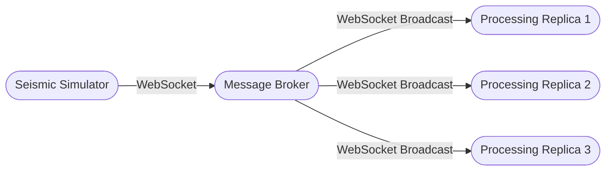
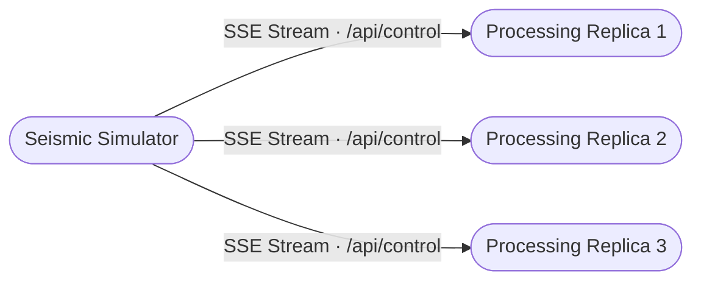
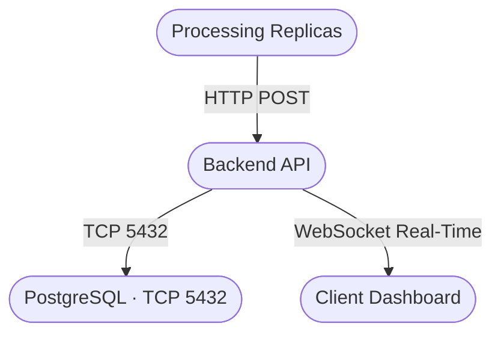
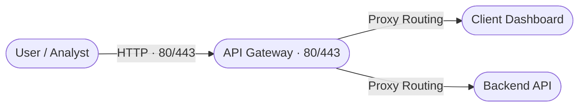

# E.C.H.O. (Earthquake & Conflict Hazard Observer) — Student Documentation

## SYSTEM DESCRIPTION

E.C.H.O. (Earthquake & Conflict Hazard Observer) is a distributed, fault-tolerant monitoring platform designed for the real-time analysis of seismic data originating from simulated sensors deployed in strategic areas. The system ingests high-frequency data streams, redistributes them through a custom broker, and processes them across computing replicas that apply a Discrete Fourier Transform (DFT).

By analysing dominant frequency components, E.C.H.O. automatically classifies threats as Earthquakes, Conventional Explosions, or Nuclear-like Events. The architecture guarantees resilience through health-checks, automatic failover, idempotent data persistence, and a centralised dashboard for real-time monitoring and historical analysis.

---

## USER STORIES

1. As a System Administrator, I want a unified `docker-compose.yml` file to spin up all microservices and the simulator with a single command so that deployment is standardised.
2. As a System Administrator, I want to implement a CI/CD pipeline (e.g., GitHub Actions) that runs automated unit tests on every pull request so that broken code is not merged into the main branch.
3. As an Intelligence Analyst, I want the system to expose a single API Gateway so that my frontend requests are seamlessly and securely routed to the correct backend services.
4. As a System Administrator, I want the API Gateway to implement rate limiting so that the system is protected against accidental denial-of-service from misconfigured clients.
5. As a System Administrator, I want the custom broker to connect to the simulator's WebSocket endpoints so that the system continuously ingests real-time raw seismic measurements.
6. As a System Administrator, I want the broker to fan-out (redistribute) incoming measurements to multiple processing replicas so that the processing load is balanced.
7. As a System Administrator, I want the broker to automatically attempt reconnection with exponential backoff if the simulator connection drops, ensuring data ingestion resumes seamlessly.
8. As a System Administrator, I want the broker to implement a dead-letter queue for malformed measurements so that invalid data does not crash the processing replicas.
9. As the System, I need to maintain an in-memory sliding window of recent time-domain measurements for each sensor to prepare the data for frequency analysis.
10. As the System, I need to apply a Discrete Fourier Transform (DFT) or an equivalent FFT method on the sliding window to extract dominant frequency components.
11. As an Intelligence Analyst, I want the system to automatically classify an event as an "Earthquake" (0.5–3.0 Hz) so that natural occurrences are categorised correctly.
12. As an Intelligence Analyst, I want the system to automatically classify an event as a "Conventional Explosion" (3.0–8.0 Hz) so I can identify potential military conflicts.
13. As an Intelligence Analyst, I want the system to classify an event as a "Nuclear-like Event" (≥ 8.0 Hz) so that I can immediately identify catastrophic strategic threats.
14. As an Intelligence Analyst, I want the system to calculate and attach a severity score to each event based on the amplitude of the signal so that I can prioritise responses to the strongest events.
15. As a System Administrator, I want the processing replicas to listen to the simulator's control stream via SSE and self-terminate upon receiving a shutdown command so that node failure is accurately simulated.
16. As a System Administrator, I want the Gateway/Broker to actively health-check processing replicas and automatically exclude failed ones from the routing pool so that operations are not interrupted.
17. As a System Administrator, I want new processing replicas to automatically register themselves with the Gateway/Broker upon startup so that the system can dynamically scale up.
18. As a System Administrator, I want to implement a circuit breaker pattern between the microservices so that cascading failures are prevented if the database or a downstream service becomes unresponsive.
19. As a System Administrator, I want detected events to be stored in a centralised relational database (PostgreSQL) so that event data is persisted securely.
20. As a System Administrator, I want the database insertion logic to be idempotent so that multiple replicas analysing the exact same event do not create duplicate database entries.
21. As a System Administrator, I want the database tables to be properly indexed by timestamp and location so that historical queries load quickly on the dashboard.
22. As a System Administrator, I want an automated data-retention script to run daily and archive events older than 30 days so that the active database remains performant.
23. As an Intelligence Analyst, I want to access a real-time web dashboard that pushes new classified events automatically (via WebSocket or SSE) so I do not have to manually refresh the page.
24. As an Intelligence Analyst, I want the dashboard to display critical visual and audio alerts specifically for "Nuclear-like Events" so that they command immediate attention.
25. As an Intelligence Analyst, I want to see an interactive map component on the dashboard displaying the geographical origins of the simulated sensors.
26. As an Intelligence Analyst, I want to filter the history of past seismic events by sensor ID, event type, and date range so that I can perform targeted post-incident analysis.
27. As an Intelligence Analyst, I want the dashboard UI to be responsive and accessible so that I can monitor the system from tablets or mobile devices in the command centre.
28. As an Intelligence Analyst, I want to filter the dashboard's event feed by Sensor ID, Event Type, and Location so that I can focus my analysis on specific high-risk regions.
29. As a System Administrator, I want the dashboard to require user authentication (login/password) so that unauthorised personnel cannot view sensitive strategic data.
30. As a System Administrator, I want an audit log to record whenever an Analyst logs in or exports data so that system access is tracked.
31. As an Intelligence Analyst, I want a button on the dashboard to export filtered historical data as a CSV or PDF report.

---

## CONTAINERS

### ARCHITECTURE & DATA FLOW (General Overview)

Before diving into the details of each container, here is a logical schema
illustrating the system architecture and how the microservices communicate
within the isolated network (`echo-network`).

---

#### 1. Ingestion & Fan-Out

---

#### 2. Fault Management (Simulated)

---

#### 3. Processing, Persistence & Push Notifications

---

#### 4. Analyst Access (Routing & Security)

---

> **Note:** The clean separation ensures that components in the *Neutral Region*
> (Gateway and Broker) handle pure stateless routing, while intensive computation
> (FFT) and data persistence happen on dedicated, isolated nodes.

---

## CONTAINER: API-Gateway

### DESCRIPTION

The API-Gateway container acts as the single entry point for the system, routing requests to backend services while enforcing load balancing and rate limiting. It shields the internal network and ensures that analysts access the correct services securely. By centralising all inbound traffic, it enables the application of security policies and implements health-check mechanisms to route traffic only to healthy nodes, guaranteeing the high reliability required by the geopolitical scenario.

### USER STORIES
3, 4, 16

### PORTS
`80:80`, `443:443`

### PERSISTENCE EVALUATION
Stateless — no data persistence required.

### EXTERNAL SERVICES CONNECTIONS
No direct external connections; manages traffic between the public network and the internal `echo-network`.

### MICROSERVICES

#### MICROSERVICE: api-gateway
- **TYPE:** middleware / reverse-proxy
- **DESCRIPTION:** Nginx proxy for routing HTTP and WebSocket traffic.
- **PORTS:** 80, 443
- **TECHNOLOGICAL SPECIFICATION:**
  `nginx:alpine` image. Configured via `nginx.conf` for upstream management.
- **SERVICE ARCHITECTURE:**
  Centralised routing configuration targeting the Dashboard and Backend-API upstreams.

- **ENDPOINTS:**

| HTTP Method | URL | Description | User Stories |
| ----------- | --- | ----------- | ------------ |
| ALL | `/api/*` | Proxy to the Backend API | 3 |
| ALL | `/ws/*` | Proxy for Dashboard WebSocket connections | 23 |

---

## CONTAINER: Message-Broker

### DESCRIPTION

The Message-Broker container acts as a buffer and distributor, decoupling the data source (the seismic simulator) from the computation engines. It ensures that high-frequency streams are efficiently balanced and fanned out to the processing replicas, protects the system from corrupted data via a dedicated dead-letter queue, and autonomously handles upstream disconnections.

### USER STORIES
5, 6, 7, 8

### PORTS
`8000:8000`

### PERSISTENCE EVALUATION
No persistence required; data is handled in-memory during fan-out.

### EXTERNAL SERVICES CONNECTIONS
WebSocket connection to the external Seismic Simulator on port `8080`.

### MICROSERVICES

#### MICROSERVICE: ingestion-broker
- **TYPE:** backend / messaging
- **DESCRIPTION:** Ingests sensor streams and broadcasts them to the processing replicas.
- **PORTS:** 8000
- **TECHNOLOGICAL SPECIFICATION:**
  Python 3.11 with `websockets` and `aiohttp` libraries.
- **SERVICE ARCHITECTURE:**
  Asynchronous, event-driven architecture designed to support high-frequency data streams.

- **ENDPOINTS:**

| HTTP Method | URL | Description | User Stories |
| ----------- | --- | ----------- | ------------ |
| WS | `/` | Internal fan-out channel for Processing Replicas | 6 |

---

## CONTAINER: Processing-Engine

### DESCRIPTION

The Processing-Engine container is E.C.H.O.'s core analytical engine. It maintains time-domain seismic data windows in RAM and executes complex mathematical computations (FFT) to identify the frequency signature of each event. By operating as multiple parallel replicas, the system ensures that monitoring is never interrupted, even when one container receives a simulated shutdown command.

### USER STORIES
9, 10, 11, 12, 13, 14, 15, 17

### PORTS
Dynamic internal ports assigned by Docker Compose.

### PERSISTENCE EVALUATION
Uses RAM to maintain the seismic sample sliding window (100 samples / 5 s).

### EXTERNAL SERVICES CONNECTIONS
SSE connection to the simulator's control service (`/api/control`).

### MICROSERVICES

#### MICROSERVICE: processing-replica
- **TYPE:** backend / data-processing
- **DESCRIPTION:** Computes FFT and classifies events. Implements the self-shutdown logic.
- **PORTS:** Internal
- **TECHNOLOGICAL SPECIFICATION:**
  Python 3.12, FastAPI, NumPy for FFT computation.
- **SERVICE ARCHITECTURE:**
  Configured with 3 horizontally scalable replicas via Docker Compose.

- **ENDPOINTS (Internal / Consumer):**

| HTTP Method | URL | Description | User Stories |
| ----------- | --- | ----------- | ------------ |
| GET (SSE) | `/api/control` | Listens for SHUTDOWN commands from the simulator | 15 |
| WS (Client) | `/api/device/{id}/ws` | Connects to the broker for data ingestion | 5, 9 |

---

## CONTAINER: Backend-API

### DESCRIPTION

The Backend-API container is the communication bridge between the computation layer and the user interface. Its primary responsibility is to ensure that events analysed by the replicas are permanently stored without duplicates (idempotency). It also exposes the REST interfaces needed for historical data retrieval and maintains open WebSocket channels to update analysts' screens with zero latency.

### USER STORIES
19, 20, 21, 22, 23, 26, 28

### PORTS
`3000` (internal, exposed via Gateway)

### PERSISTENCE EVALUATION
Interacts with the PostgreSQL database for long-term event storage.

### EXTERNAL SERVICES CONNECTIONS
None.

### MICROSERVICES

#### MICROSERVICE: backend-api
- **TYPE:** backend
- **DESCRIPTION:** RESTful API for historical queries and idempotency management.
- **PORTS:** 3000
- **TECHNOLOGICAL SPECIFICATION:**
  Python 3.11, FastAPI, `asyncpg` for asynchronous PostgreSQL access, Pydantic for schema validation.
- **SERVICE ARCHITECTURE:**
  Includes a `ConnectionManager` to handle simultaneous WebSocket connections from dashboard clients.

- **ENDPOINTS:**

| HTTP Method | URL | Description | User Stories |
| ----------- | --- | ----------- | ------------ |
| POST | `/events` | Event insertion with `ON CONFLICT DO NOTHING` logic | 19, 20, 23 |
| GET | `/events` | Historical queries with filters (sensor_id, event_type, date) | 26, 28 |
| GET | `/events/count` | Event count for dashboard pagination | 26 |
| GET | `/health` | Database connection status check | 16 |
| WS | `/ws` | Real-time channel for pushing events to the dashboard | 23 |

- **DB STRUCTURE:**

**`seismic_events`** — `id` · `event_id (UNIQUE)` · `sensor_id` · `event_type` · `dominant_hz` · `latitude` · `longitude` · `severity_score` · `timestamp` · `replica_id`

**`seismic_events_archive`** — Archive table for events older than 30 days.

---

## CONTAINER: Database

### DESCRIPTION

The Database container serves as the permanent repository for all classified seismic measurements. Configured with dedicated indexes on geolocation, timestamps, and alert type, it enables fast report loading on the analysts' dashboard while concurrently supporting the automated tasks responsible for archiving operational data.

### PORTS
`5432:5432`

### PERSISTENCE EVALUATION
Requires persistence via a Docker volume (`echo-db-data`) to guarantee data retention across container restarts.

### MICROSERVICES

#### MICROSERVICE: echo-database
- **TYPE:** database
- **DESCRIPTION:** PostgreSQL 15 instance.
- **PORTS:** 5432

---

## CONTAINER: Client-Dashboard

### DESCRIPTION

The Client-Dashboard container provides intelligence analysts with a visual command centre. Through interactive maps and a live-streaming event feed, it enables immediate strategic decision-making. The interface is solely responsible for user experience (UI/UX), delegating all validation and historical storage entirely to the underlying backend services.

### USER STORIES
23, 24, 25, 27, 28, 29, 30, 31

### PORTS
Accessible via Gateway (Port 80).

### PERSISTENCE EVALUATION
Stateless. User authentication (US-29, 30) is mocked client-side in this version of the system.

### EXTERNAL SERVICES CONNECTIONS
Connection to Leaflet / OpenStreetMap APIs for map rendering.

### MICROSERVICES

#### MICROSERVICE: dashboard
- **TYPE:** frontend
- **DESCRIPTION:** React SPA for Intelligence Analysts.
- **TECHNOLOGICAL SPECIFICATION:**
  React 19.2, Leaflet for cartography, WebSockets for live updates.

- **PAGES:**

| Name | Description | Related Microservice | User Stories |
| ---- | ----------- | -------------------- | ------------ |
| `App.js` | Main view and push-alert management | backend-api | 23, 24, 27, 28, 31 |
| `SeismicMap.js` | Geographical sensor visualisation | backend-api | 25 |